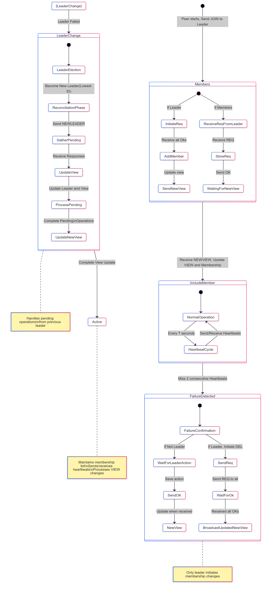

# Membership Algorithm Implementation

## Overview

This project implements a membership algorithm in a distributed system environment. The membership service allows peers (servers) to join and leave the network, detect failures, and handle leader failures, ensuring that all peers maintain a consistent view of the current members. This implementation is done in Go, simulating the interactions between peers using a combination of TCP and UDP communications for reliability and broadcasting.

## System Architecture

The architecture follows a peer-to-peer model with a centralized leader responsible for managing join and leave requests. Each peer is aware of the entire membership list and periodically sends heartbeat messages to detect failures. The architecture consists of the following components:

- **Leader Node**: Handles join and leave requests, initiates view changes, and maintains a consistent membership list.
- **Peer Nodes**: Connect to the leader to join the network, maintain a local view of the membership list, and respond to heartbeats and view change messages.
- **Communication Module**: Handles TCP and UDP-based message exchanges between nodes. TCP ensures reliable communication for critical messages like `JOIN`, `REQ`, `OK`, `NEWVIEW`, and `NEWLEADER` whereas UDP is used for  heartbeats.

### Components

- **main.go**: The entry point that starts a peer as either a leader or a normal peer. It contains the core logic for initialization, message handling, and managing concurrent events through goroutines.
- **stateManager.go**: Manages the state transitions, including joining, updating membership, and handling failures.
- **tcpCommunication.go**: Handles reliable communication between nodes, particularly for join and leave requests.
- **udpCommunication.go**: Implements the unreliable but lightweight heartbeat mechanism.
- **peerManager.go**: Maintains the current view of the membership list and handles peer-specific operations.
- **util.go**: Contains utility functions used across the application.

## State Diagram

The algorithm can be represented as a state diagram showing the different states a peer can be in: Idle, Joining, Active, Failure Detection, and Leader Election. Each state has transitions triggered by specific messages or events such as receiving a `JOIN` request, missing heartbeats, or detecting leader failure. The diagram helps visualize the flow of operations within the membership algorithm, particularly during events such as adding or removing peers and leader elections.

## Design Decisions

### Concurrency and Multi-threading

The implementation of the membership algorithm in `main.go` heavily leverages Go's concurrency model to handle multiple events simultaneously. Each peer runs several goroutines to manage different tasks concurrently:

- **Join and Leave Operations**: Each join and leave operation is handled in its own goroutine. This ensures that a peer can handle multiple requests concurrently without blocking its main execution. By spawning a new goroutine for each request, peers can listen for heartbeats, respond to requests, and initiate view changes concurrently.

- **Heartbeat Mechanism**: Heartbeat messages are broadcasted periodically using a separate goroutine for each peer. This design ensures that failure detection runs concurrently with other membership operations, such as joins and leaves. Each peer runs a goroutine that sends heartbeat messages and another that listens for incoming heartbeats from other peers.

- **Leader Coordination**: The leader uses concurrent handlers for managing join and leave requests from peers. When a peer joins, the leader starts a new goroutine to broadcast a `REQ` message to all peers and waits for `OK` messages to complete the view change. The concurrent handling allows the leader to initiate new view changes even while existing ones are in progress, ensuring responsiveness in dynamic network environments.

### Reliable Communication for Membership Changes

For critical operations like adding or removing peers, TCP was used to ensure that messages are reliably delivered.

### UDP for Heartbeat

Heartbeat messages are lightweight and frequent, making UDP an ideal choice despite its unreliability. n

### Leader-Based Coordination

The leader is responsible for managing the membership to simplify coordination and ensure a total order of view changes. This design minimizes conflicts and ensures that view IDs are consistent across all peers. The `main.go` implementation includes logic to elect a new leader automatically in the event of a failure, using the peer with the lowest ID as the new leader.

### Pending Operations Handling

In the event of a leader failure, pending operations are completed by the new leader. This ensures that no membership change is lost, providing strong consistency guarantees even during leadership transitions. The new leader gathers any pending operations using the `NEWLEADER` message, ensuring that all previously started operations are finalized.

Please refer to README.md for the instructions on running the program.
